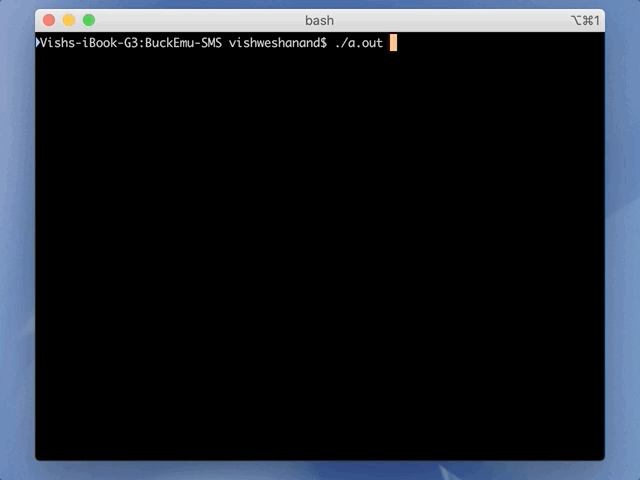

# BuckEmu SMS

An Emulator for the Sega Master System in C++. (written for Mac OS currently)

Compile with:
`make`

Run with:
`./a.out`

---
### Progress
- [x] Memory Management (Complete)
- [x] ROM Cartridge Loading (Complete)
- [x] Z80 CPU Implementation (Complete)
- [ ] VDP Graphics (In Progress)
- [ ] Input (Todo)

BuckEmu SMS running the [ZEXALL](https://www.smspower.org/Homebrew/ZEXALL-SMS) Instruction Exerciser ROM to demonstrate the Z80 CPU executing opcodes:

---
### Info
Code Style: Tabs are 4 Spaces.

[SMSPower](https://www.smspower.org/Development/Documents) has been a great resource for system documentation.
