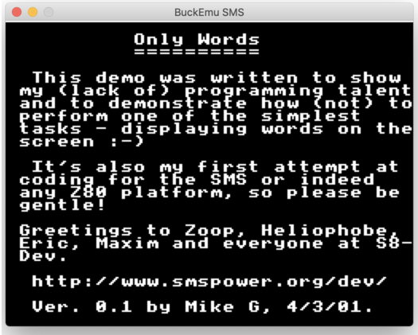

# BuckEmu SMS

An Emulator for the [Zilog Z80](https://en.wikipedia.org/wiki/Zilog_Z80) CPU in C++. (written for Mac OS currently)

The CPU emulation is complete, all 677 instruction 
[opcodes](http://clrhome.org/table/) have been implemented, along with the CPU registers, interrupts, and
memory management. The eventual goal is to have a fully-functional
[Sega Master System](https://en.wikipedia.org/wiki/Master_System) emulator.

This project has been invaluable in helping me gain a lower-level understanding of how Computer Hardware, Memory, and
CPUs operate.

Compile with:
`make`

Run with:
`./a.out`

---
### Progress
- [x] Memory Management (Complete)
- [x] ROM Cartridge Loading (Complete)
- [x] Z80 CPU Implementation (Complete)
- [ ] VDP Graphics (In Progress)
- [ ] Input (Todo)
- [ ] Audio (Todo)

BuckEmu SMS running the [ZEXALL](https://www.smspower.org/Homebrew/ZEXALL-SMS) Instruction Exerciser ROM to demonstrate the Z80 CPU executing opcodes:

Running [Only Words](https://www.smspower.org/Homebrew/OnlyWords-SMS) to demonstrate background tiling:

Running [Pause Test](https://www.smspower.org/Homebrew/PauseTest-SMS) to demonstrate frame interrupts and VDP scrolling:

---
### Info
Code Style: Tabs are 4 Spaces.

[SMSPower](https://www.smspower.org/Development/Documents) has been a great resource for system documentation.
